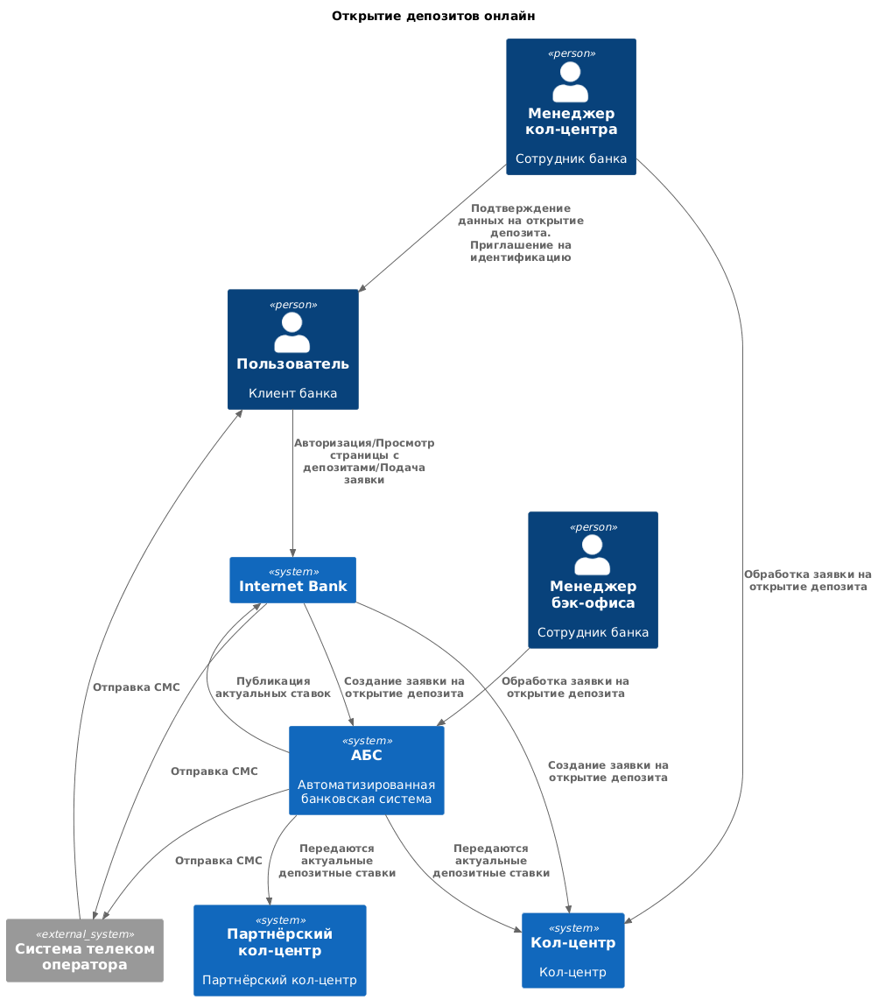

### **Название задачи:** Передача ставок в кол-центр
### **Автор:** Беляев А.Г.
### **Дата:** 10.12.2025
### **Функциональные требования**

| **№** | **Действующие лица или системы**                  | **Use Case**                                                         | **Описание**                                                                                                                                                                                                                                                                   |
| - | --------------------------------------------- | ---------------------------------------------------------------- | -------------------------------------------------------------------------------------------------------------------------------------------------------------------------------------------------------------------------------------------------------------------------- |
| UC1 | АБС,  внутренний кол-центр,  менеджер бэкофиса  | Передача актуальных депозитных ставок в внутренний кол-центр  | – менеджер бэкофиса обновил ставки – АБС отправляет сообщение с изменениями в kafka – внутренний кол-центр считывает сообщения из кафки и применяет изменения                                                                                                        |
| UC2 | АБС,  партнерский кол-центр,  менеджер бэкофиса | Передача актуальных депозитных ставок в  партнерский кол-центр | – менеджер бэкофиса обновил ставки – АБС формирует файл со ставками и отправляет его в  письме – Партнерский кол-центр получает письмо |

### **Нефункциональные требования**

| **Код** | **Нефункциональные требования**  | **Описание**  |
|---------|----------------------------------|--------------------------------------------------------------------------------------------------------------|
| **P**   | **Производительность (Performance)** |                                                                                                              |
| P3  | -                                | Нужно подключить к работе партнерский кол-центр, чтобы разгрузить внутренний кол-центр                                  |
| **+R**  | **+ Ограничения (Restrictions)**     |                                                                                                              |
| +R7 | -                                | Решение должно быть сделано на основе текущего процесса работы со ставками                                   |
| +R8 |                                  | Партнерский кол-центр готов получать актуальные ставки в виде файлов.  Кол-центр не может использовать API-вызовы |

### **Решение**

Диаграмма контекста

Диаграмма контейнеров

Обоснование:

1. Используем Kafka для передачи ставок для внутреннего кол-центра. Этот компонент у нас уже есть в MVP. Нагрузка на АБС минимальна, т.к. взаимодействие АБС с Kafka тоже есть.

2. Передача файлов во внешний кол-центр:  
На стороне АБС будет создан дополнительный сервис, отправляющий письмо внешнему кол-центру.

### **Альтернативы**

**1. Унифицированное взаимодествие для всех кол-центров (через API или kafka)**

Плюсы:
- единое решение для интеграции всех систем. меньше кода для поддержки.
- оперативное обновление ставок

Минусы:
- Не соответствует текущим ограничениям партнёрского кол-центра (нет возможности работать с API)
- требуется больше доработок на стороне АБС

Возможно, применимо в будущем, если партнер будет готов модернизировать свою систему.

**Недостатки, ограничения, риски**

Kafka:
- Kafka требует дополнительных ресурсов для настройки и поддержки. Если у разработчиков нет опыта работы с kafka, то увеличатся временные затраты на разработку.

Отправка файлов e-mail:
- Ручная загрузка на стороне партнёрского кол-центра (риск человеческих ошибок)
- неоперативное обновление данных
